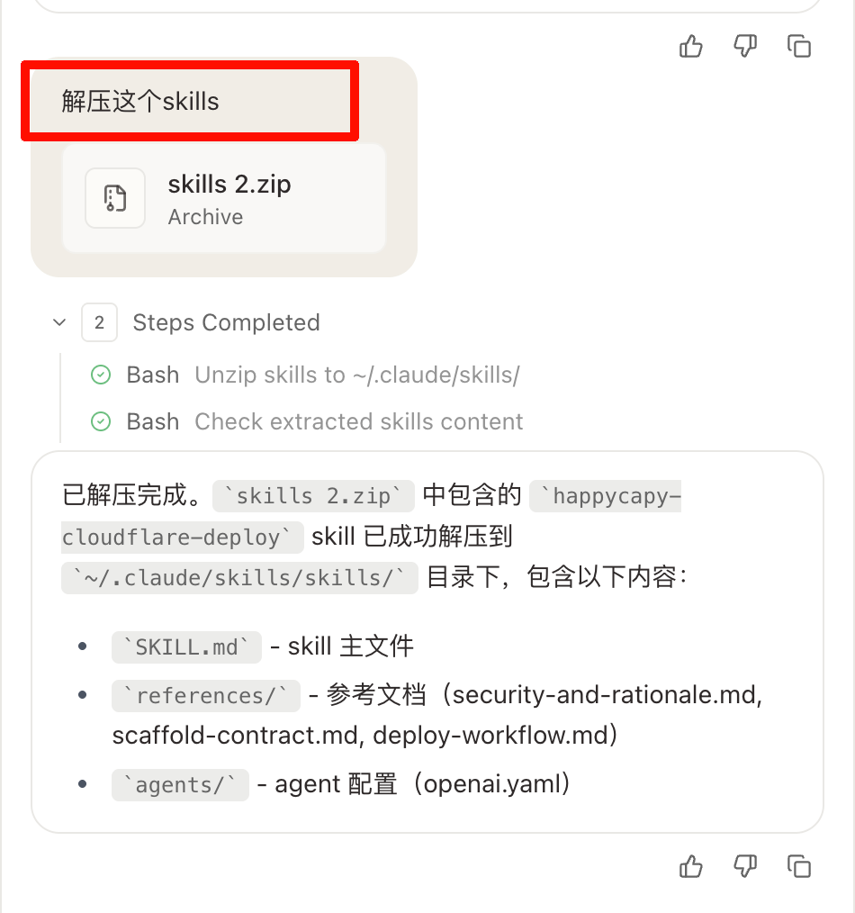
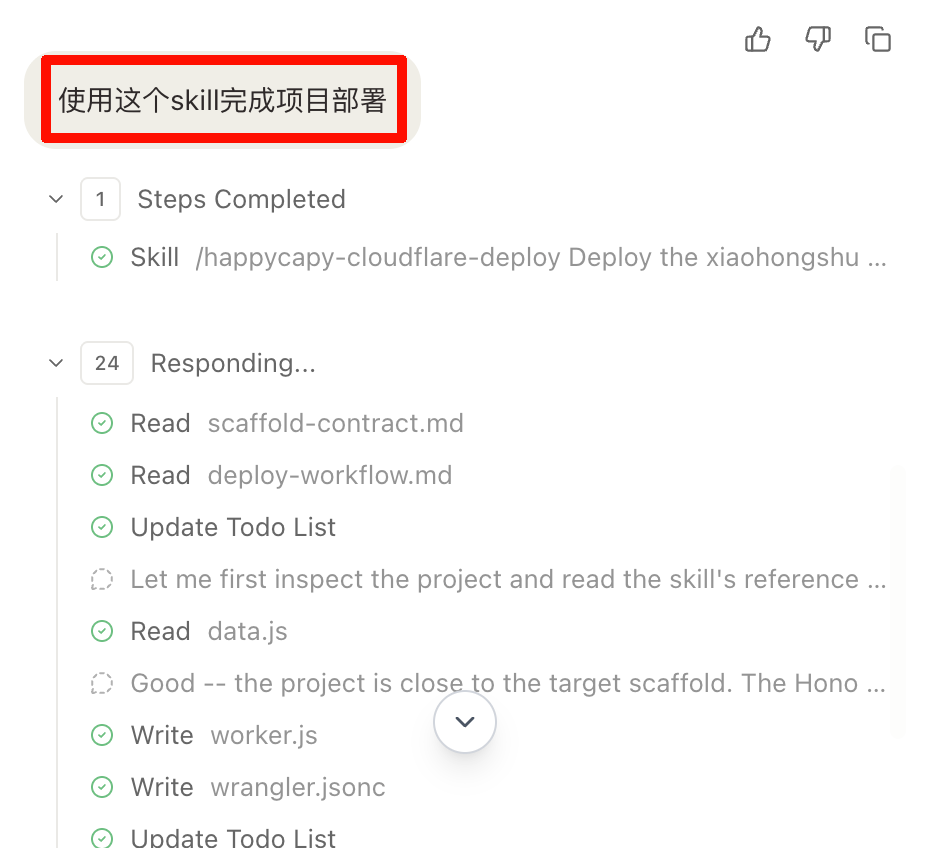
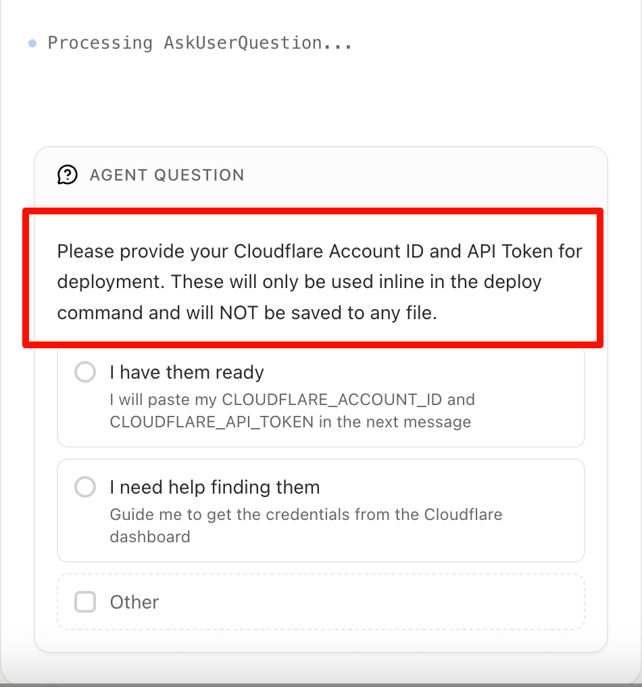
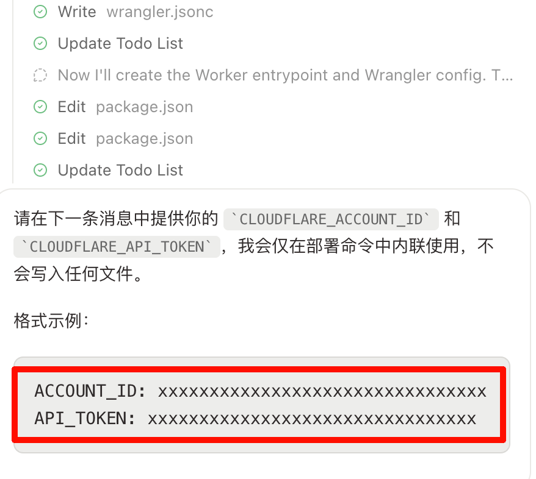
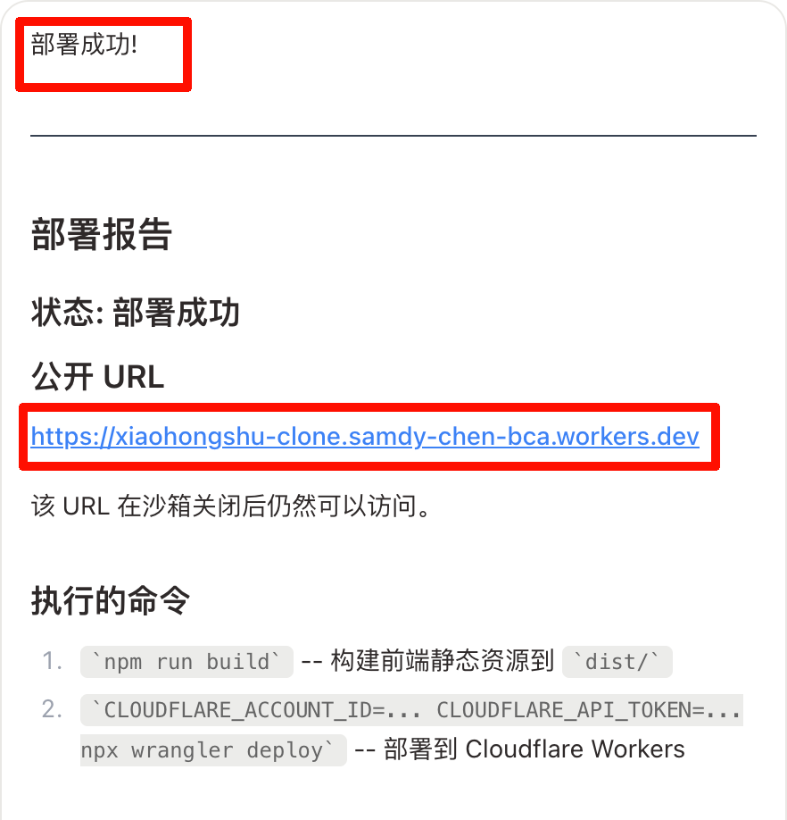

# Happycapy Cloudflare Deploy Skill

这个仓库提供一个可直接给 Happycapy 使用的 Skill，用来把全栈项目部署到 Cloudflare Workers for Platforms，并返回一个所有人都可以访问的公网 URL。

这个 Skill 的核心约束很简单：

- 只向用户索取 `CLOUDFLARE_ACCOUNT_ID` 和 `CLOUDFLARE_API_TOKEN`
- 自动检查并规范化项目到可部署形态
- 自动创建或复用 Dispatch Namespace、Dispatch Worker、User Worker
- 返回稳定的公网入口 URL，而不是依赖沙盒预览

## 仓库结构

```text
.
├── README.md
├── docs/
│   └── images/
│       ├── 1.png
│       ├── 2.png
│       ├── 3.png
│       ├── 4.png
│       ├── 5.png
│       └── 6.png
└── skills/
    └── happycapy-cloudflare-deploy/
        ├── SKILL.md
        ├── agents/
        └── references/
```

Skill 根目录：

- `skills/happycapy-cloudflare-deploy`

## 这个 Skill 做什么

它不是单纯执行一次 `wrangler deploy`。它会先判断项目是否接近 Happycapy 约束的 Cloudflare 脚手架，然后自动补齐 Workers for Platforms 所需的部署层。

默认流程包括：

1. 读取项目脚手架和构建配置
2. 自动把项目规范化到可部署状态
3. 只在真正部署前向用户索取 `Account ID` 和 `API Token`
4. 自动生成或复用 Dispatcher 和 User Worker 的部署资源
5. 执行部署并返回一个公网 URL

这样做的结果是：

- 项目不再依赖 Happycapy 沙盒预览
- 沙盒关闭后，公网 URL 仍可访问
- 任何人都可以通过这个 URL 访问项目

## 使用方法

### 1. 用 Happycapy 生成一个全栈应用


### 2. 让 Happycapy 解压并加载这个 Skill



Skill 目录使用：

- `skills/happycapy-cloudflare-deploy`

### 3. 让 Happycapy 调用 Skill 开始部署



推荐调用思路：

```text
使用 $happycapy-cloudflare-deploy 检查当前项目并自动规范化到可部署状态。
部署目标是 Cloudflare Workers for Platforms。
整个流程只向我索取 CLOUDFLARE_ACCOUNT_ID 和 CLOUDFLARE_API_TOKEN。
不要把密钥写进任何项目文件，最后返回一个公网可访问的 URL。
```

### 4. 按提示提供 Cloudflare Account ID 和 API Token



当前版本只需要这两个值：

- `CLOUDFLARE_ACCOUNT_ID`
- `CLOUDFLARE_API_TOKEN`

后续生产化建议：

- 不再让用户直接把 ID 和 API Token 发给 Happycapy
- 由 Happycapy 后端统一保存 Cloudflare 凭证
- Skill 只传业务参数，后端负责真正部署

### 5. 使用示例



### 6. 部署成功后获得公网入口



部署成功后，Skill 会返回一个可以直接在浏览器打开的 URL。这个 URL 面向公网，不依赖本地沙盒，因此可以被所有人访问。

## 为什么这个方法能公开访问

原因很直接：

- 预览链接是沙盒态资源，沙盒关闭后会失效
- 这个 Skill 部署到的是 Cloudflare 边缘网络
- Skill 返回的是 Dispatcher 暴露出来的公网入口 URL

所以最终访问链路是：

1. Happycapy 生成项目
2. Skill 自动规范化项目
3. Skill 调用 Cloudflare Workers for Platforms 部署
4. Cloudflare 返回公网地址
5. 用户和外部访客都可以直接访问

## 安全边界

当前版本是先跑通部署链路，不是最终生产安全方案。

约束如下：

- 不把 Cloudflare 凭证写入仓库
- 不把 Cloudflare 凭证写入 `.env`
- 只在当前部署命令环境中使用凭证
- 正式产品化时应改为后端托管密钥

## 适合的项目类型

这个 Skill 优先面向以下项目：

- Vite
- React
- Tailwind CSS
- Hono
- Wrangler

如果项目已经接近这个脚手架，Skill 会尽量自动补齐并完成部署。
